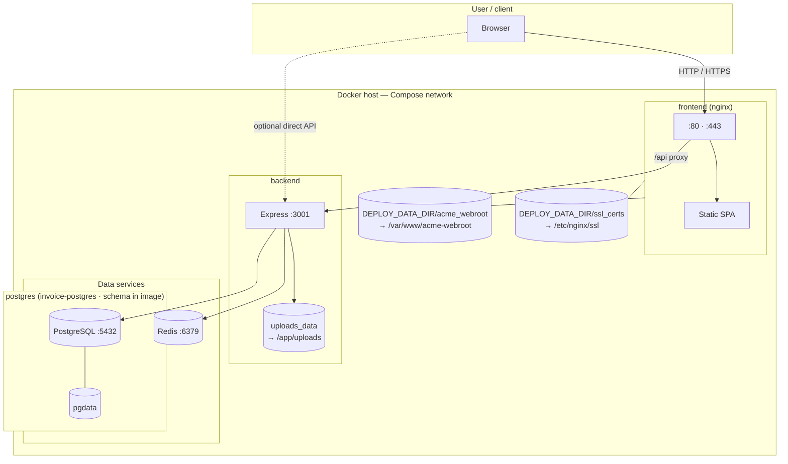

# Deployment diagram

**Postgres, Redis, and uploads** use **named volumes** (no app source bind mount). **TLS** uses **host bind mounts** under **`DEPLOY_DATA_DIR`** (default **`./data`** in the directory that contains **`docker-compose-prod.yml`**): **`acme_webroot/`** and **`ssl_certs/`**. **Prod** pulls **`maxwayne/invoice-*:1.0`** from Docker Hub; **build** tags **`invoice-*:1.0`** locally.

**Notes**

- **Postgres:** **`maxwayne/invoice-postgres:1.0`** (prod) bakes `schema.sql`; empty **`pgdata`** runs init scripts on first container start. Persistent data lives in the **`pgdata`** volume only.
- **TLS:** Host dirs **`acme_webroot/`** and **`ssl_certs/`** under **`DEPLOY_DATA_DIR`** (bind-mounted); own them as the user running **acme.sh**—see **[tls.md](tls.md)**.
- The browser uses nginx for the SPA; nginx forwards `/api` to the **`backend`** service on the Docker network.
- **Uploads:** company logos and similar files use the **`uploads_data`** volume at **`/app/uploads`** in the backend container.
- The backend runs **`ensureSchema()`** on startup against PostgreSQL (idempotent column/enum upgrades). See [Runtime schema upgrades](../docs/database/schema.md#runtime-schema-upgrades).
