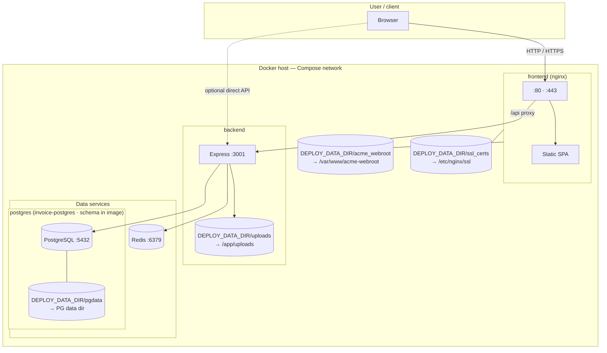

# Deployment diagram

**Postgres data** and **backend uploads** use **host bind mounts** under **`DEPLOY_DATA_DIR`**. In compose, volume paths use **`${DEPLOY_DATA_DIR:-./data}`** (default **`./data`** next to the compose file if unset — see **[`.env.example`](.env.example)**). Subdirs: **`pgdata/`** → PostgreSQL data dir, **`uploads/`** → **`/app/uploads`**. **TLS** uses the same base: **`acme_webroot/`** and **`ssl_certs/`**. **Redis** has no persistent volume in the default Compose files. **Prod** pulls **`maxwayne/invoice-*:1.0`** from Docker Hub; **build** tags **`invoice-*:1.0`** locally.

**Notes**

- **Postgres:** **`maxwayne/invoice-postgres:1.0`** (prod) bakes `schema.sql`; an **empty** **`DEPLOY_DATA_DIR/pgdata`** runs init scripts on first container start. Persistent data lives only on the host under that directory.
- **TLS:** Host dirs **`acme_webroot/`** and **`ssl_certs/`** under **`DEPLOY_DATA_DIR`** (bind-mounted); own them as the user running **acme.sh**—see **[tls.md](tls.md)**.
- The browser uses nginx for the SPA; nginx forwards `/api` to the **`backend`** service on the Docker network.
- **Uploads:** company logos and similar files live under **`DEPLOY_DATA_DIR/uploads`** on the host, mounted at **`/app/uploads`** in the backend container.
- The backend runs **`ensureSchema()`** on startup against PostgreSQL (idempotent column/enum upgrades). See [Runtime schema upgrades](../docs/database/schema.md#runtime-schema-upgrades).
