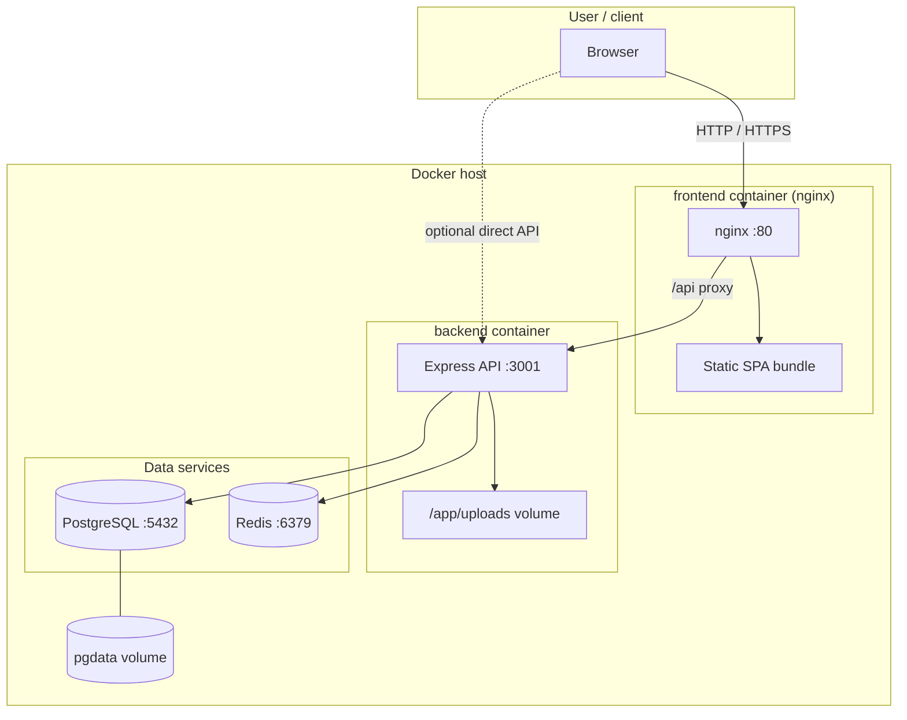

# Deployment diagram

**Notes**

- In production, TLS often terminates in front of nginx (not shown).
- The browser only talks to nginx for the SPA; nginx forwards `/api` to the backend service name on the Docker network.
- Uploaded logos are stored under `backend/uploads` and mounted into the backend container.
- The backend runs **`ensureSchema()`** on startup against PostgreSQL (idempotent column/enum upgrades). See [Runtime schema upgrades](../docs/database/schema.md#runtime-schema-upgrades).
