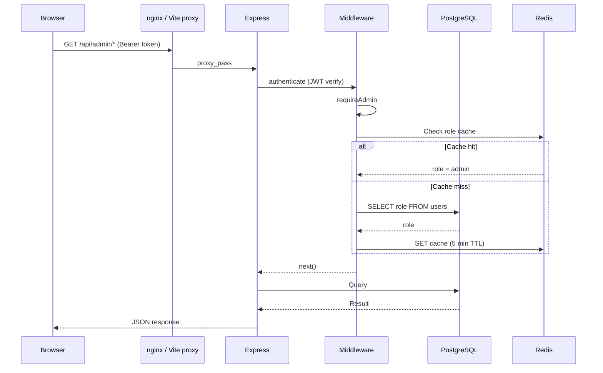
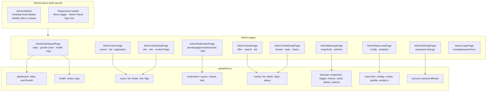

# Admin panel overview

Standalone management interface at `/admin`. Separate layout, sidebar, and login from the main user-facing app. All backend routes sit under `/api/admin` and require both JWT authentication and `role = 'admin'`.

## Access control

1. Browser navigates to any `/admin/*` route.
2. `AdminLayout` checks the Zustand auth store for a valid token **and** `user.role === 'admin'`.
3. If either check fails the `AdminLoginPage` is shown in-place (no redirect).
4. On the backend every `/api/admin` route passes through two middleware layers:
   - **`authenticate`** — verifies the JWT and attaches `userId`.
   - **`requireAdmin`** — looks up the user's role (cached in Redis for 5 minutes, falls back to PostgreSQL). Returns **403** if not admin.
5. The default admin account is seeded on startup from the `ADMIN_EMAIL` / `ADMIN_PASSWORD` environment variables (see `docker-compose.yml`).

## Layout

| Component | File | Role |
|-----------|------|------|
| `AdminLayout` | `frontend/src/components/layout/AdminLayout.tsx` | Auth guard, responsive header ("Admin Panel" + sign-out), desktop sidebar + mobile drawer, `<Outlet />` |
| `AdminSidebar` | `frontend/src/components/layout/AdminSidebar.tsx` | Dark nav sidebar used in desktop mode and the mobile slide-in drawer |

**Sidebar links:** Dashboard, Users, Moderation, Tickets, Backups, Rate Limits, Settings.

## Architecture diagrams

### Admin request flow

### Admin component architecture

## Backend modules

| Path | Responsibility |
|------|----------------|
| `routes/admin/index.ts` | Mounts all sub-routers; applies `authenticate` + `requireAdmin` globally |
| `routes/admin/dashboard.ts` | `/dashboard/stats`, `/dashboard/user-growth` |
| `routes/admin/users.ts` | `/users` list, `/:id` detail, `/:id/role`, `/:id/flag` |
| `routes/admin/moderation.ts` | `/moderation` queue, `/:id` review, `/bulk` |
| `routes/admin/tickets.ts` | `/tickets` list, `/:id` detail + reply + status |
| `routes/admin/health.ts` | `/health` checks, `/health/logs` |
| `routes/admin/backups.ts` | `/backups` snapshots, trigger, restore, verify, delete, `/backups/policies` |
| `routes/admin/rateLimit.ts` | `/rate-limits` config CRUD, `/rate-limits/analytics` |
| `routes/admin/account.ts` | `/account/password` — admin password reset |
| `middleware/adminAuth.ts` | `requireAdmin()` — role check with Redis cache |
| `services/adminDashboard.ts` | Stats aggregation, user growth, user list/detail, role updates |
| `services/adminHealth.ts` | DB / Redis / frontend / backend health checks; system metrics; log queries |
| `services/adminModeration.ts` | Content flag CRUD, queue, review (single + bulk), user content scan |
| `services/adminTickets.ts` | Ticket list/detail, reply, status, per-user queries |
| `services/adminBackup.ts` | Snapshot create/restore/verify/delete, policies, automated runs, retention enforcement |
| `models/adminValidation.ts` | Zod schemas for all admin request bodies and query strings |

## Related docs

- [Admin pages reference](pages.md) — per-page details, UI, actions, API calls
- [API reference — Admin endpoints](../api/reference.md#admin-panel-admin-role-required)
- [Frontend routes](../frontend/routes.md#admin-routes)
- [Database schema](../database/schema.md)
