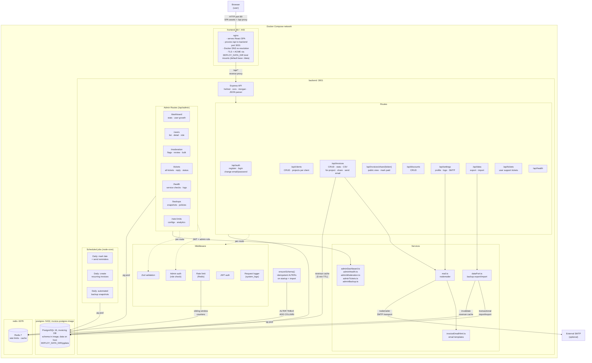
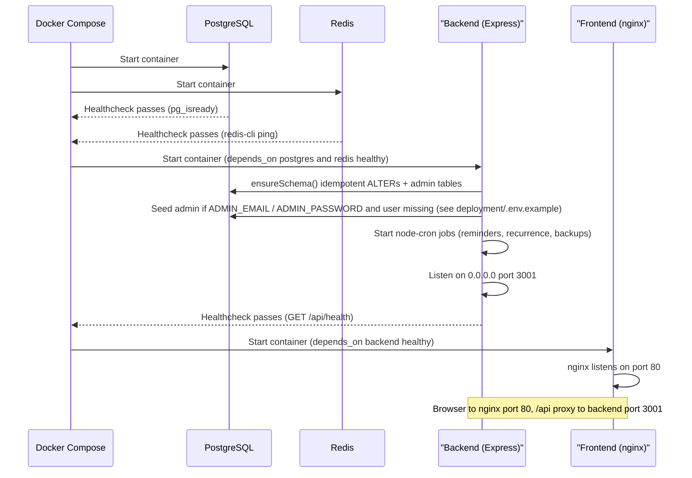
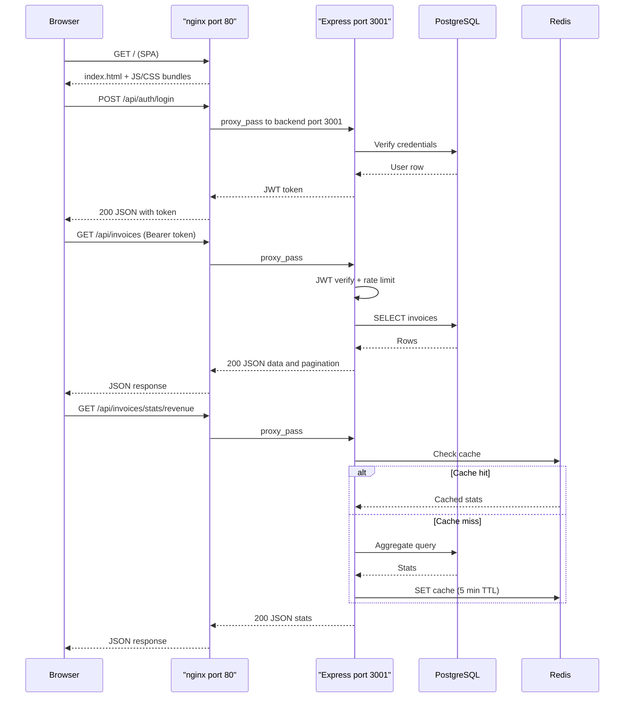
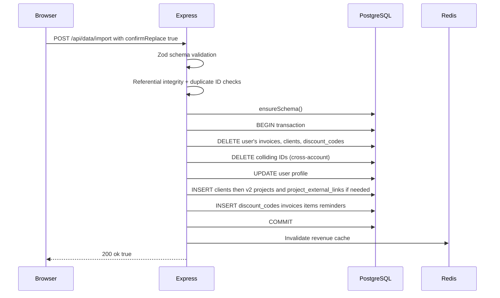
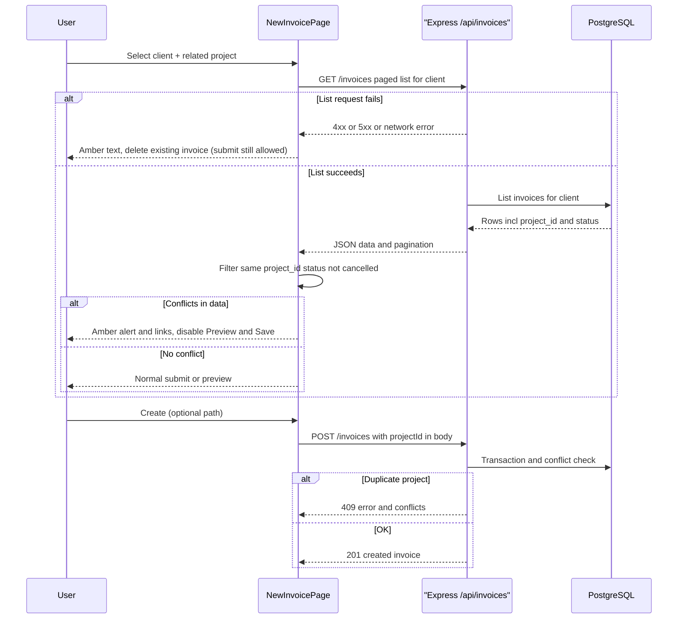
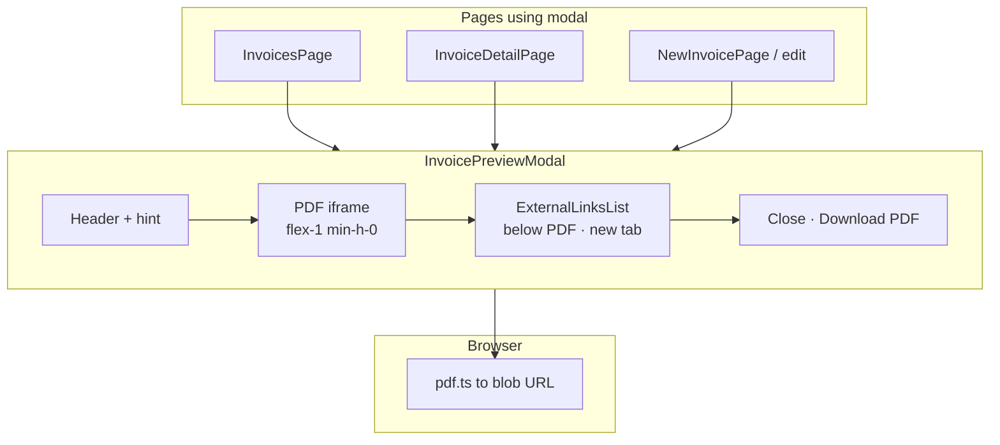

# Architecture diagram

## Docker Compose stack

Compose bind mounts for Postgres, backend uploads, and TLS use **`${DEPLOY_DATA_DIR:-./data}`** on the host (see **`deployment/.env.example`** and **`deployment/tls.md`** §2). Below, **`DEPLOY_DATA_DIR/...`** means that resolved base path.

## Startup sequence

## Request flow

## Data flow: backup import

## New invoice: project conflict (SPA + API)

At most **one non-`cancelled`** invoice may reference a given **`project_id`** per user. The **new/edit invoice** page loads **`GET /api/invoices?page=1&limit=100&clientId=...`** when both client and project are selected ( **`limit`** is capped at **100** by the list endpoint), then filters rows client-side for matching **`project_id`** and **non-`cancelled`** status.

- **Conflicts found in list data:** Bordered **amber** alert with invoice numbers (links to **`/invoices/:id`**). **Preview** and **Create/Save** are disabled while the request is in flight or when this list is non-empty.
- **List request fails:** Plain **amber** line: *Selected project already has an invoice, delete existing invoice before creating a new one.* **Preview** and **Create/Save** stay enabled; the server still enforces the rule on submit (**409** if duplicate).

**`POST /api/invoices`** and **`PUT /api/invoices/:id`** always enforce the rule and return **409** with **`conflicts`** when the UI is bypassed or the client-side list did not reflect the true state.

## Invoice preview modal (SPA)

Client-only: **`InvoicePreviewModal`** builds a PDF with **jsPDF** (`pdf.ts`), shows it in an **`iframe`**, and lists **`project_external_links`** as HTML **below** the PDF so **`target="_blank"`** works reliably (embedded PDF URI links typically navigate the iframe, not a new tab).

## SPA UI themes (browser)

The static SPA bundle does not change per theme server-side: **themes are client-only**. `index.html` loads JS that applies `data-theme` on `<html>` and CSS variables for the canvas, sidebar, and accents. See **[Frontend overview — UI themes](frontend/overview.md#ui-themes)** for stores, pickers, and the Mermaid flow diagram.
