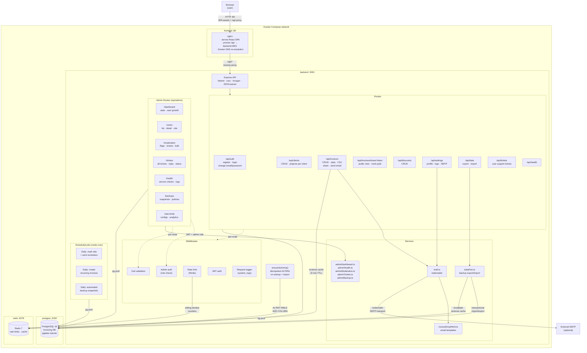
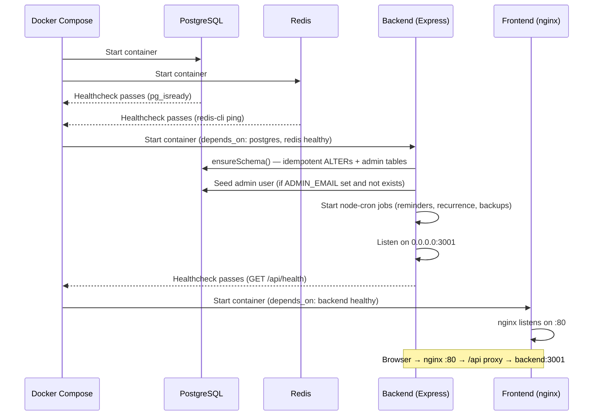
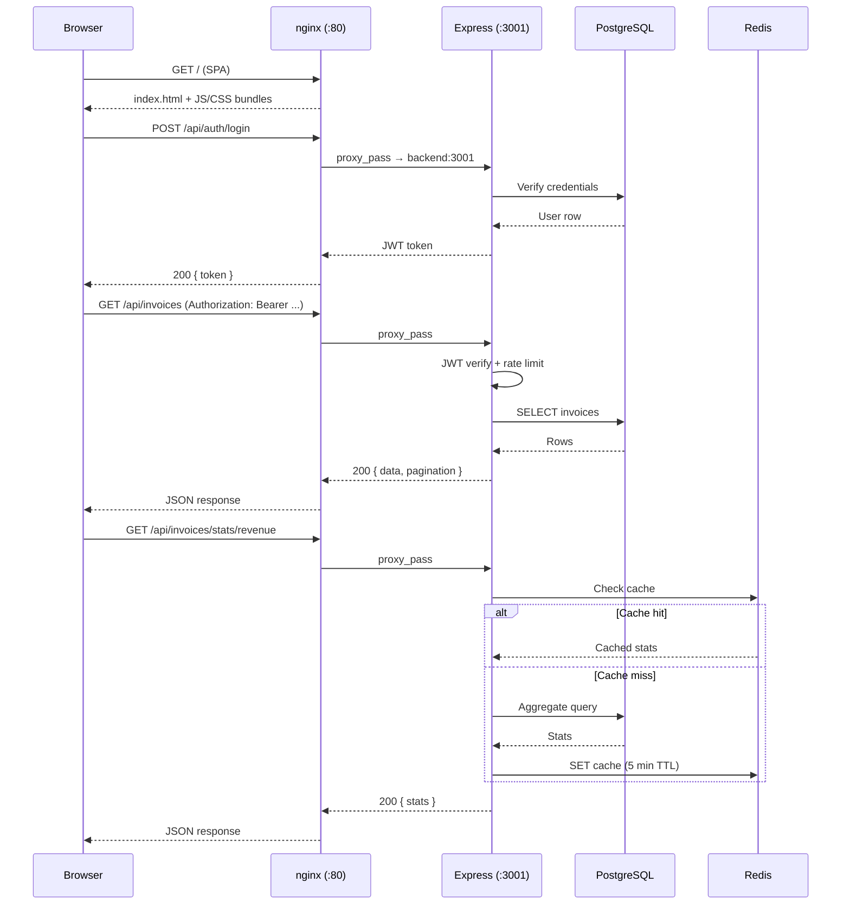
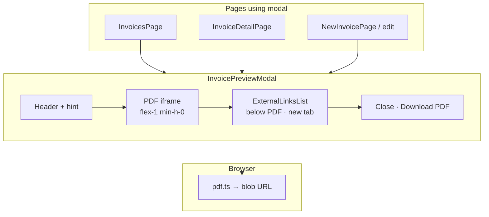

# Architecture diagram

## Docker Compose stack



## Startup sequence



## Request flow



## Data flow: backup import

```mermaid
sequenceDiagram
    participant B as Browser
    participant E as Express
    participant PG as PostgreSQL
    participant RD as Redis

    B->>E: POST /api/data/import { data, confirmReplace: true }
    E->>E: Zod schema validation
    E->>E: Referential integrity + duplicate ID checks
    E->>PG: ensureSchema()
    E->>PG: BEGIN transaction
    E->>PG: DELETE user's invoices, clients, discount_codes
    E->>PG: DELETE colliding IDs (cross-account)
    E->>PG: UPDATE user profile
    E->>PG: INSERT clients; if v2: projects, project_external_links
    E->>PG: INSERT discount_codes, invoices (with project_id if v2), items, reminders
    E->>PG: COMMIT
    E->>RD: Invalidate revenue cache
    E-->>B: 200 { ok: true }
```

## Invoice preview modal (SPA)

Client-only: **`InvoicePreviewModal`** builds a PDF with **jsPDF** (`pdf.ts`), shows it in an **`iframe`**, and lists **`project_external_links`** as HTML **below** the PDF so **`target="_blank"`** works reliably (embedded PDF URI links typically navigate the iframe, not a new tab).


