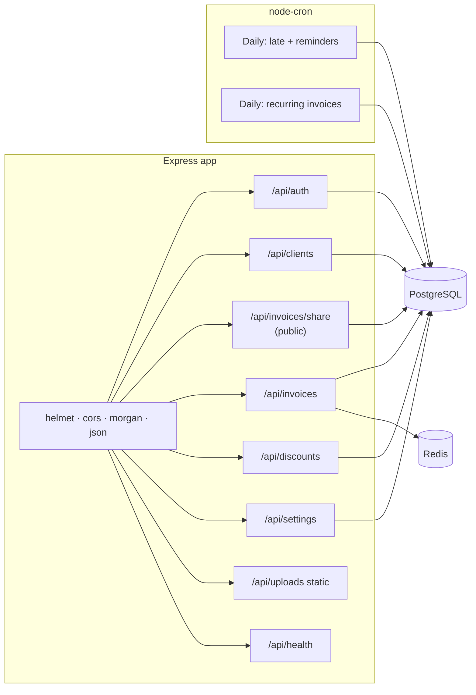

# Backend overview

Express (TypeScript) application in `backend/src/`. Entry: `server.ts` loads `app.ts`, connects to PostgreSQL and Redis, and starts scheduled jobs.

## Request pipeline

Global middleware on `app.ts`: `helmet` → `cors` → `morgan` → `express.json()`. Static files for uploads at `/api/uploads`.

Per-route: **rateLimit** (Redis) → **validate** (Zod) → **authenticate** (JWT) as required.

## Main modules

| Path | Responsibility |
|------|------------------|
| `routes/auth.ts` | Register, login |
| `routes/clients.ts` | Client CRUD, customer numbers |
| `routes/invoices.ts` | Invoices, `GET /stats/revenue`, `GET /stats/by-client/:clientId`, CSV, share tokens, send-to-company email |
| `routes/share.ts` | Public read-only invoice by token |
| `routes/discounts.ts` | Discount codes |
| `routes/settings.ts` | Company profile, defaults, logo upload/delete |
| `middleware/auth.ts` | JWT verification |
| `middleware/validate.ts` | Zod validation |
| `middleware/rateLimit.ts` | Redis sliding windows / counters |
| `jobs/reminders.ts` | Cron: late invoices, reminders, recurring drafts |
| `config/database.ts` | `pg` pool, optional schema ensure |

## Backend diagram

## Related docs

- [API review](../api/review.md) / [reference](../api/reference.md)
- [Database schema](../database/schema.md)
- [Deployment](../../deployment/guide.md)
