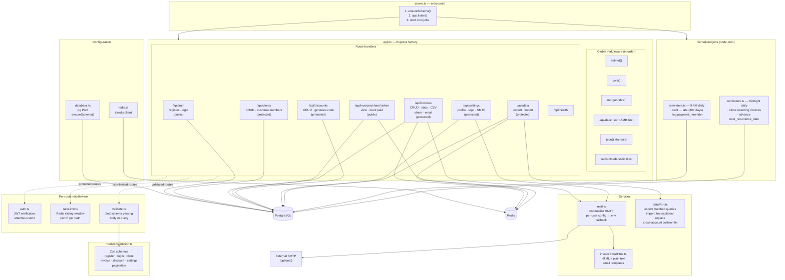
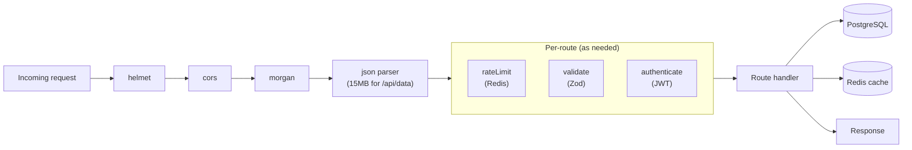
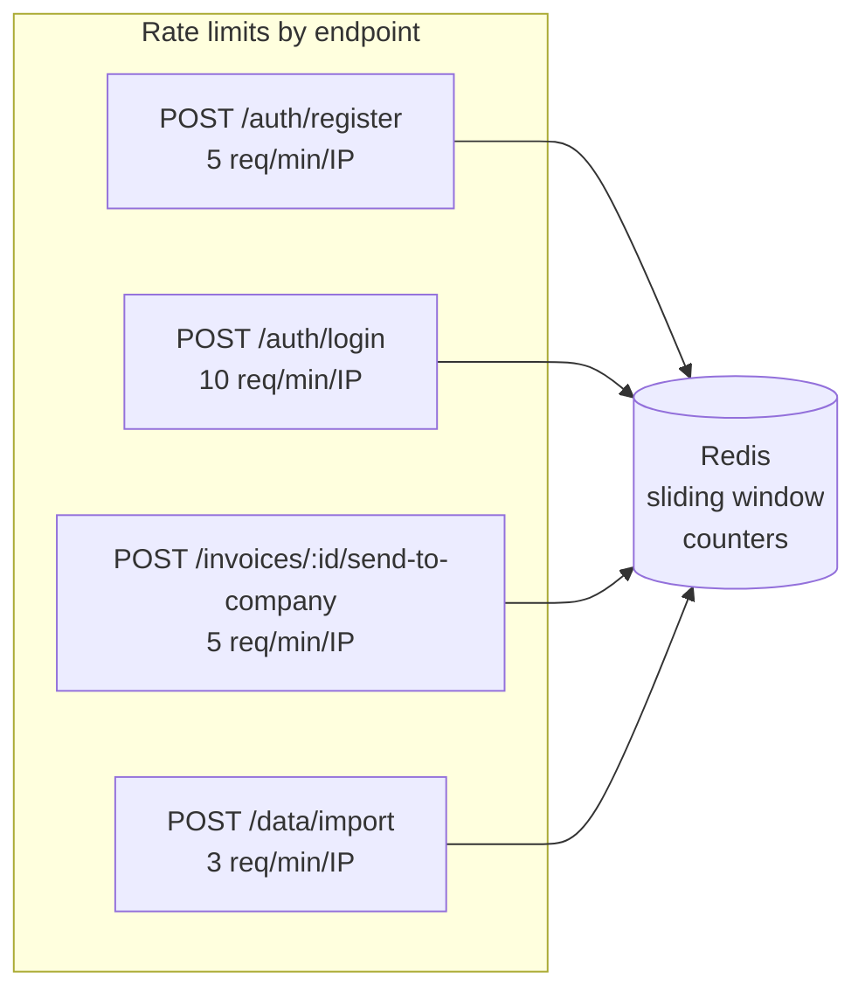
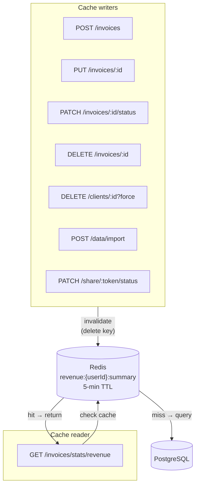
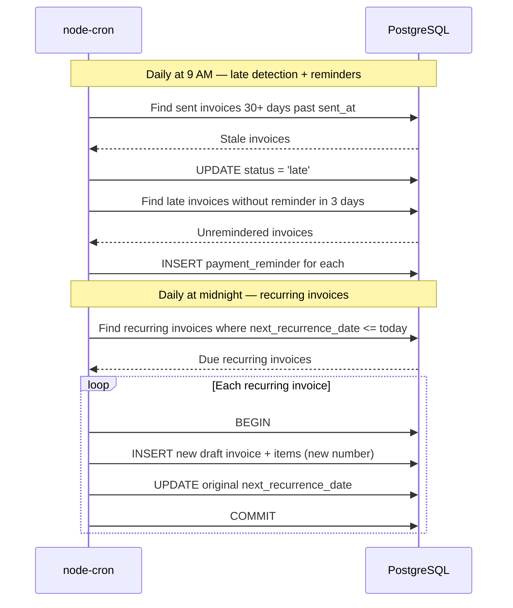

# Backend overview

Express (TypeScript) application in `backend/src/`. Entry: `server.ts` loads `app.ts`, connects to PostgreSQL and Redis, and starts scheduled jobs.

## Request pipeline

Global middleware on `app.ts`: `helmet` → `cors` → `morgan` → **`/api/data`** with `express.json({ limit: '15mb' })` → `express.json()` for all other routes. Static files for uploads at `/api/uploads`.

Per-route: **rateLimit** (Redis) → **validate** (Zod) → **authenticate** (JWT) as required.

## Main modules

| Path | Responsibility |
|------|------------------|
| `routes/auth.ts` | Register, login |
| `routes/clients.ts` | Client CRUD, customer numbers |
| `routes/invoices.ts` | Invoices, `GET /stats/revenue`, `GET /stats/by-client/:clientId`, CSV, share tokens, send-to-company email |
| `routes/share.ts` | Public invoice by token: read-only view + mark as paid |
| `routes/discounts.ts` | Discount codes |
| `routes/settings.ts` | Company profile, defaults, logo upload/delete, SMTP config (GET/PUT), SMTP test email |
| `routes/dataPort.ts` | `GET /export`, `POST /import` — authenticated JSON backup / restore; numeric fields use `z.coerce.number()` to accept both numbers and DB string decimals; validation failures logged to console |
| `services/dataPort.ts` | Builds export payload (batched queries); calls `ensureSchema()` then transactional replace on import with strict Zod validation, referential integrity, duplicate-ID checks, and cross-account ID collision removal |
| `services/mail.ts` | Nodemailer SMTP transport; resolves config from per-user DB settings then env vars as fallback; used by send-to-company and SMTP test |
| `services/invoiceEmailHtml.ts` | HTML + plain-text email templates for invoice summaries |
| `middleware/auth.ts` | JWT verification |
| `middleware/validate.ts` | Zod validation |
| `middleware/rateLimit.ts` | Redis sliding windows / counters |
| `jobs/reminders.ts` | Cron: late invoices, reminders, recurring drafts |
| `config/database.ts` | `pg` pool; **`ensureSchema()`** — idempotent `ALTER`s on startup (and before backup import) so older databases match expected columns/enums; see [schema doc](../database/schema.md#runtime-schema-upgrades) |

## Backend diagrams

### Component architecture

### Request pipeline

### Rate limits

### Caching strategy

### Scheduled jobs

On process start, **`ensureSchema()`** runs in `server.ts` before the HTTP server listens; **`POST /api/data/import`** also invokes it before the import transaction. Both hit PostgreSQL via the shared pool. See [Runtime schema upgrades](../database/schema.md#runtime-schema-upgrades).

## Related docs

- [API review](../api/review.md) / [reference](../api/reference.md)
- [Database schema](../database/schema.md)
- [Deployment](../../deployment/guide.md)
