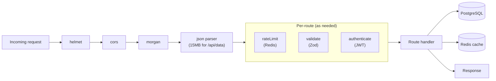
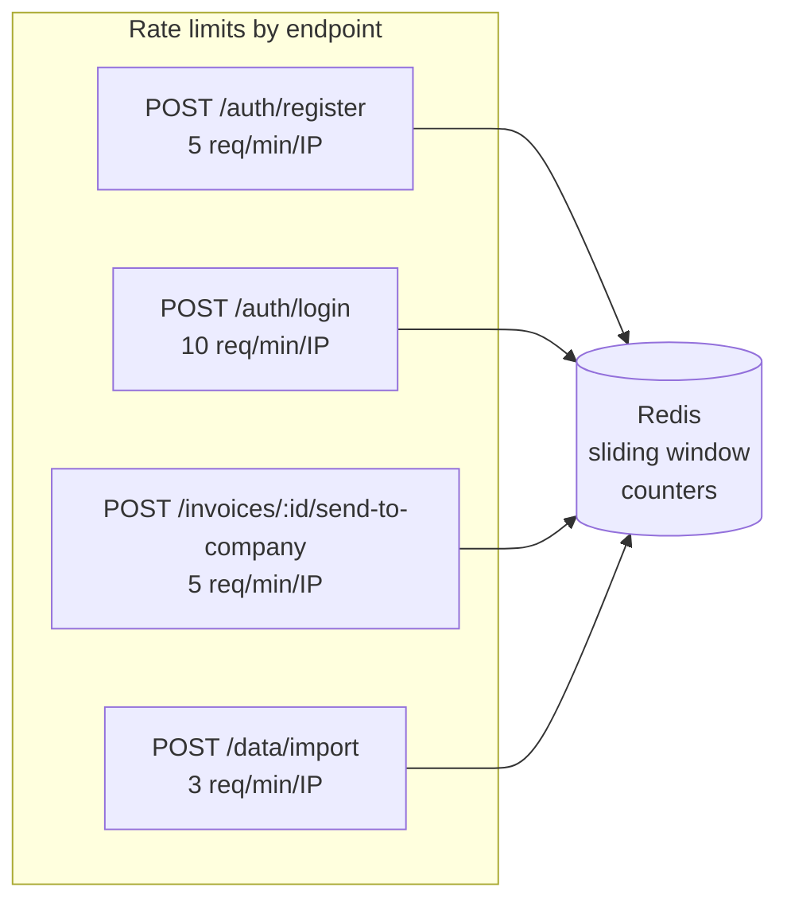
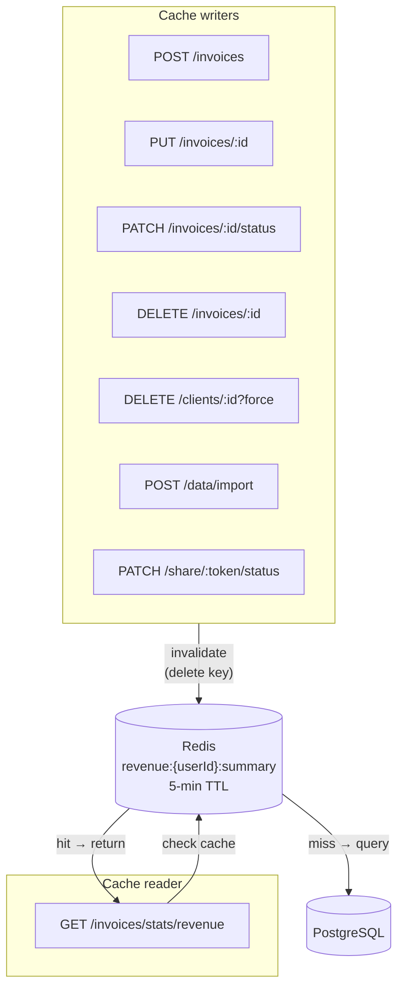
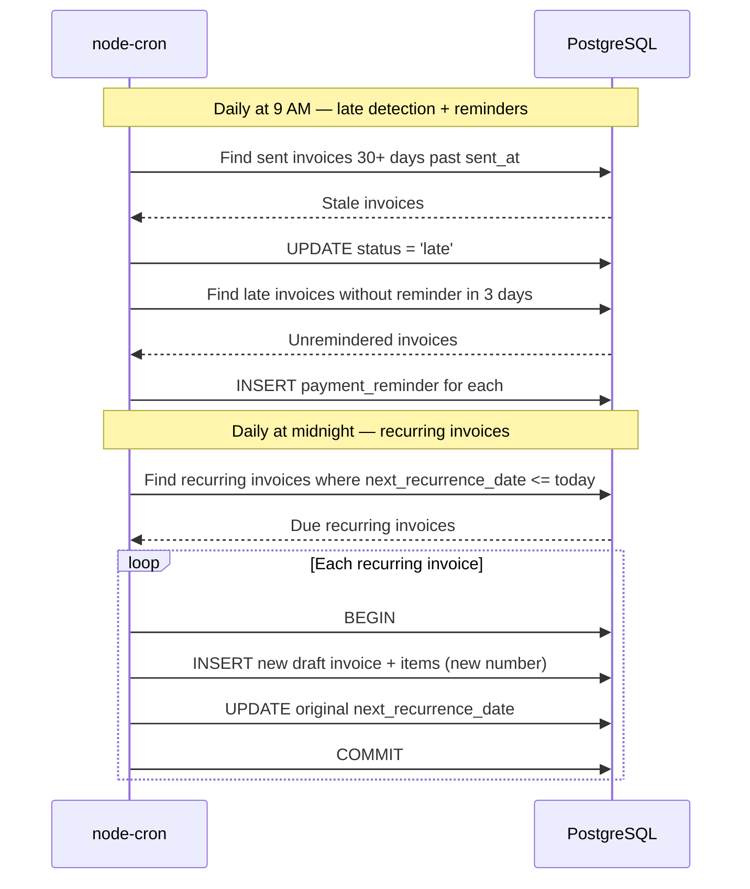

# Backend overview

Express (TypeScript) application in `backend/src/`. Entry: `server.ts` loads `app.ts`, connects to PostgreSQL and Redis, and starts scheduled jobs.

## Request pipeline

Global middleware on `app.ts`: `helmet` → `cors` → `morgan` → **`/api/data`** with `express.json({ limit: '15mb' })` → `express.json()` for all other routes. Static files for uploads at `/api/uploads`.

Per-route: **rateLimit** (Redis) → **validate** (Zod) → **authenticate** (JWT) as required.

## Main modules

| Path | Responsibility |
|------|------------------|
| `routes/auth.ts` | Register, login, change email/password (authenticated) |
| `routes/projects.ts` | Per-client projects: `/:clientId/projects` and `/:clientId/projects/:projectId` (JWT); mounted on `/api/clients` **before** `clients.ts` |
| `routes/clients.ts` | Client CRUD, customer numbers |
| `routes/invoices.ts` | Invoices (list with optional `clientId`, **`GET /for-project/:projectId`** for conflict rows), create/update with **409** when a non-cancelled invoice already uses **`projectId`**, `GET /stats/revenue`, `GET /stats/by-client/:clientId`, CSV, share tokens, send-to-company email |
| `routes/share.ts` | Public invoice by token: read-only view + mark as paid |
| `routes/discounts.ts` | Discount codes |
| `routes/settings.ts` | Company profile, defaults, logo upload/delete, SMTP config (GET/PUT), SMTP test email |
| `routes/dataPort.ts` | `GET /export`, `POST /import` — authenticated JSON backup / restore; numeric fields use `z.coerce.number()` to accept both numbers and DB string decimals; validation failures logged to console |
| `routes/tickets.ts` | User-facing support ticket submission |
| `routes/admin/` | Admin panel routes: dashboard, users, moderation, tickets, health, backups, rate limits — all require JWT + admin role |
| `services/dataPort.ts` | Builds export payload (batched queries): **v2** includes `projects`, `project_external_links`, and invoice `project_id`; **v1** omits projects. Import normalizes legacy backup `project_attachments` (http URLs) into links. Calls `ensureSchema()` then transactional replace with Zod validation, referential integrity, duplicate-ID checks, and cross-account ID collision removal |
| `services/mail.ts` | Nodemailer SMTP transport; resolves config from per-user DB settings then env vars as fallback; used by send-to-company and SMTP test |
| `services/invoiceEmailHtml.ts` | HTML + plain-text email templates for invoice summaries |
| `services/adminDashboard.ts` | Admin stats, user growth, user list/detail, role updates |
| `services/adminHealth.ts` | Service health checks (DB, Redis, frontend via `FRONTEND_URL` defaulting to `http://frontend:80`, backend), system metrics, log queries |
| `services/adminModeration.ts` | Content flag management and review |
| `services/adminTickets.ts` | Admin ticket management, replies, status updates |
| `services/adminBackup.ts` | Backup snapshot management, policies, verify/restore |
| `middleware/auth.ts` | JWT verification |
| `middleware/adminAuth.ts` | Admin role verification (DB lookup with Redis cache) |
| `middleware/validate.ts` | Zod validation |
| `middleware/rateLimit.ts` | Redis sliding windows / counters; supports DB-configurable rules |
| `middleware/requestLogger.ts` | Logs requests to `system_logs` table for admin health monitoring |
| `models/adminValidation.ts` | Zod schemas for all admin endpoints |
| `jobs/reminders.ts` | Cron: late invoices, reminders, recurring drafts; recurring invoices use per-customer invoice-number sequencing |
| `jobs/backups.ts` | Cron: daily automated backup snapshots |
| `config/database.ts` | `pg` pool; **`ensureSchema()`** — idempotent `ALTER`s and `CREATE TABLE IF NOT EXISTS` on startup (and before backup import) so older databases match expected columns/enums/tables; seeds admin user from `ADMIN_EMAIL`/`ADMIN_PASSWORD` env vars; see [schema doc](../database/schema.md#runtime-schema-upgrades) |

## Backend diagrams

### Component architecture

```mermaid
flowchart TB
  subgraph Server["server.ts — entry point"]
    direction TB
    BOOT["1. ensureSchema()\n2. app.listen()\n3. start cron jobs"]
  end

  subgraph App["app.ts — Express factory"]
    direction TB
    subgraph MW["Global middleware (in order)"]
      H["helmet()"]
      C["cors()"]
      M["morgan('dev')"]
      J15["/api/data: json 15MB limit"]
      J1M["json() standard"]
      STATIC["/api/uploads static files"]
    end

    subgraph Routes["Route handlers"]
      AUTH["/api/auth\nregister · login (public)\nchange email/password (protected)"]
      CL["/api/clients\nprojects (nested) · CRUD ·\ncustomer numbers\n(protected)"]
      SH["/api/invoices/share/:token\nview · mark paid\n(public)"]
      INV["/api/invoices\nCRUD · for-project · stats · CSV\nshare · email\n(protected)"]
      DISC["/api/discounts\nCRUD · generate code\n(protected)"]
      SET["/api/settings\nprofile · logo · SMTP\n(protected)"]
      DATA["/api/data\nexport · import\n(protected)"]
      TIX["/api/tickets\nuser support tickets\n(protected)"]
      HL["/api/health"]
    end

    subgraph AdminRoutes["Admin route handlers (/api/admin)"]
      ADM_DASH["/dashboard\nstats · user growth"]
      ADM_USERS["/users\nlist · detail · role"]
      ADM_MOD["/moderation\nflags · review · bulk"]
      ADM_TIX["/tickets\nall tickets · reply"]
      ADM_HEALTH["/health\nservice checks · logs"]
      ADM_BACK["/backups\nsnapshots · policies"]
      ADM_RL["/rate-limits\nconfigs · analytics"]
    end
  end

  subgraph Middleware["Per-route middleware"]
    JWT["auth.ts\nJWT verification\nattaches userId"]
    ADMIN_MW["adminAuth.ts\nRole check (DB + Redis cache)"]
    RL["rateLimit.ts\nRedis sliding window\nper IP per path"]
    ZOD["validate.ts\nZod schema parsing\nbody or query"]
    REQLOG["requestLogger.ts\nLogs to system_logs table"]
  end

  subgraph Services["Services"]
    MAIL["mail.ts\nnodemailer SMTP\nper-user config → env fallback"]
    TMPL["invoiceEmailHtml.ts\nHTML + plain text\nemail templates"]
    DP["dataPort.ts\nexport: batched queries\nimport: transactional replace\ncross-account collision fix"]
    ADM_SVC["adminDashboard.ts · adminHealth.ts\nadminModeration.ts · adminTickets.ts\nadminBackup.ts"]
  end

  subgraph Jobs["Scheduled jobs (node-cron)"]
    REM["reminders.ts — 9 AM daily\n· sent → late (30+ days)\n· log payment_reminder"]
    REC["reminders.ts — midnight daily\n· clone recurring invoices\n· advance next_recurrence_date"]
    BKUP["backups.ts — 2 AM daily\n· automated backup snapshots"]
  end

  subgraph Validation["models/validation.ts"]
    SCHEMAS["Zod schemas\nregister · login · client\ninvoice · discount · settings\npagination"]
  end

  subgraph Config["Configuration"]
    DB["database.ts\npg Pool\nensureSchema()"]
    RDS["redis.ts\nioredis client"]
  end

  PG[(PostgreSQL)]
  RD[(Redis)]
  SMTP_EXT["External SMTP\n(optional)"]

  %% Startup
  BOOT --> App
  BOOT --> Jobs

  %% Middleware wiring
  Routes -. "protected routes" .-> JWT
  Routes -. "rate-limited routes" .-> RL
  Routes -. "validated routes" .-> ZOD
  AdminRoutes -. "JWT + admin role" .-> JWT
  AdminRoutes -. "admin role check" .-> ADMIN_MW
  AdminRoutes -. "validated routes" .-> ZOD
  ZOD --> SCHEMAS

  %% Route → Service
  INV --> MAIL
  SET --> MAIL
  DATA --> DP
  MAIL --> TMPL
  AdminRoutes --> ADM_SVC

  %% Config → External
  DB --> PG
  RDS --> RD

  %% Route → Data stores
  AUTH --> PG
  CL --> PG
  SH --> PG
  INV --> PG
  INV --> RD
  DISC --> PG
  SET --> PG
  DATA --> PG
  DATA --> RD
  SH --> RD
  TIX --> PG
  AdminRoutes --> PG
  ADMIN_MW --> RD

  %% Jobs → Data stores
  REM --> PG
  REC --> PG
  BKUP --> PG

  %% External
  MAIL --> SMTP_EXT
```

### Request pipeline

### Rate limits

### Caching strategy

### Scheduled jobs

On process start, **`ensureSchema()`** runs in `server.ts` before the HTTP server listens; **`POST /api/data/import`** also invokes it before the import transaction. Both hit PostgreSQL via the shared pool. See [Runtime schema upgrades](../database/schema.md#runtime-schema-upgrades).

## Related docs

- [API review](../api/review.md) / [reference](../api/reference.md)
- [Database schema](../database/schema.md)
- [Deployment](../../deployment/guide.md)
