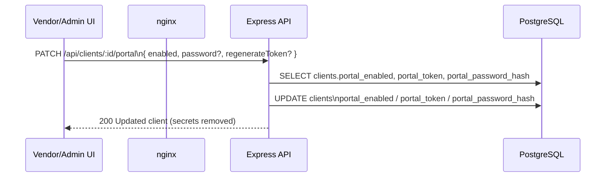
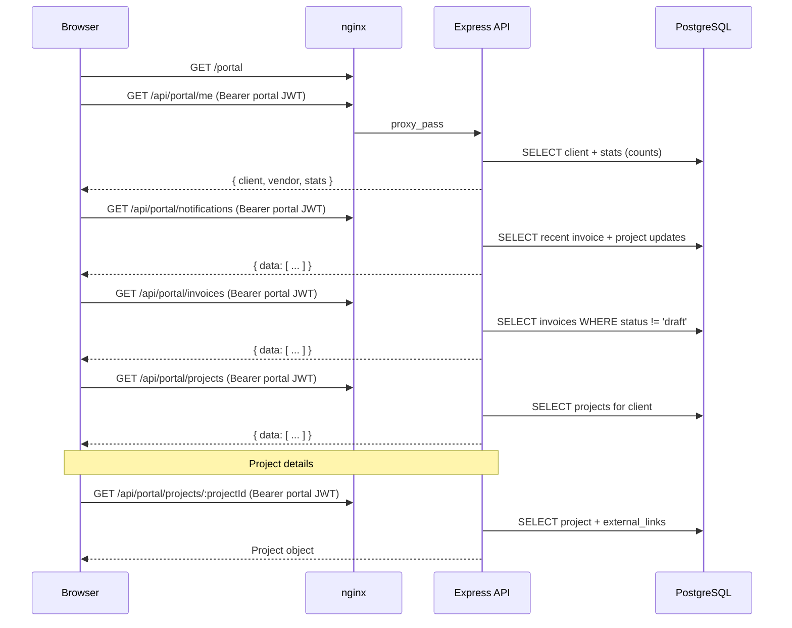
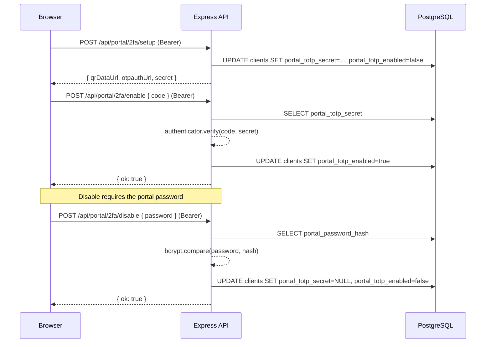
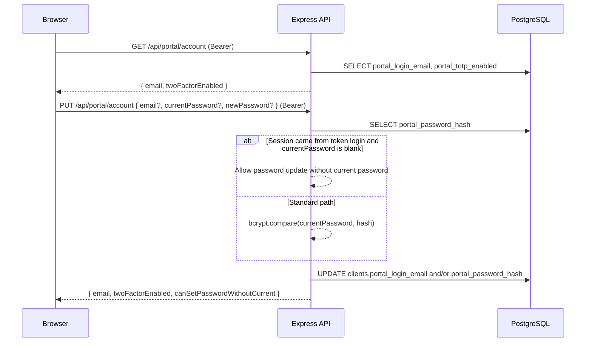

# Client Portal Login + Usage

This document describes the **login process** (including optional TOTP 2FA) and the **post-login data loading** behavior.

## 1) Vendor setup (enable + token + password)

The vendor/admin enables the portal by updating the client’s portal settings.



### Important rules

- If the vendor enables the portal, the backend requires a portal password hash to exist (or the call provides `password`).
- Regenerating the token instantly invalidates old links because login uses `clients.portal_token`.

## 2) Client login flow (token or email + password, optional TOTP)

### Login options

Clients can sign in using either:
- **Access token + password** (default; vendor shares a portal link containing the token)
- **Email + password** (optional; client sets a login email under `/portal/account`)

Both flows share the same endpoint: `POST /api/portal/auth/login`.

Failed sign-in (**401** invalid credentials, **403** portal disabled / password not set, **401** bad TOTP, etc.) shows the API **`error`** text in an **inline alert** on **`PortalLoginPage`** (not only a toast).

### Login with username-less “access token”

The client portal login page uses a token (access link) created by the vendor.

```mermaid
flowchart TD
  A[/portal/login?token=<portal_token>] --> B[Client enters access token + password]
  B --> C[POST /api/portal/auth/login]
  C --> D{portal has TOTP enabled?}
  D -- No --> E[Backend verifies password hash]
  D -- Yes --> F{Client provided totpCode?}
  F -- No --> G[Backend returns requiresTwoFactor=true]
  F -- Yes --> H[Backend verifies TOTP code]
  E --> I[Backend returns portal JWT]
  H --> I[Backend returns portal JWT]
  I --> J[Redirect to /portal]
```

### Login with email + password

```mermaid
flowchart TD
  A[/portal/login] --> B[Client selects Email login\nenters email + password]
  B --> C[POST /api/portal/auth/login]
  C --> D{portal has TOTP enabled?}
  D -- No --> E[Backend verifies password hash]
  D -- Yes --> F{Client provided totpCode?}
  F -- No --> G[Backend returns requiresTwoFactor=true]
  F -- Yes --> H[Backend verifies TOTP code]
  E --> I[Backend returns portal JWT]
  H --> I[Backend returns portal JWT]
  I --> J[Redirect to /portal]
```

### 2FA step (TOTP)

When TOTP is enabled, the backend will respond with `requiresTwoFactor: true` if `totpCode` is missing.

## 3) Post-login usage (dashboard, invoices, projects, notifications)

After login, the portal loads data from `/api/portal/*` using the portal JWT (`Authorization: Bearer ...`).



The projects list includes a visible **View project** call-to-action on each card to open the detail route.

### “Real-time” behavior

In v1, “real-time notifications” are approximated with **polling**:

- the UI refreshes `/api/portal/notifications` about once per minute while the dashboard is open

## 4) Security page: TOTP setup/enable/disable

After signing in, the client can manage 2FA on `/portal/security`.



## 5) Client-facing data rules (what’s shown)

- **Invoices:** the backend returns only invoices with `status != 'draft'`.
- **Notifications:** includes recent invoice/project status updates for this client.

## 6) Account page: set portal login email + change password

The Account page is available at `/portal/account` (authenticated).



The Account form shows inline success feedback after save (for example: **Password saved**), and the save button briefly changes to **Saved**.

