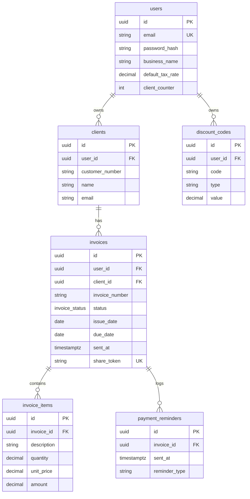

# Database diagram

```mermaid
erDiagram
  users ||--o{ clients : owns
  users ||--o{ discount_codes : owns
  clients ||--o{ invoices : has
  invoices ||--o{ invoice_items : contains
  invoices ||--o{ payment_reminders : logs

  users {
    uuid id PK
    string email UK
    string password_hash
    string business_name
    decimal default_tax_rate
    int client_counter
  }

  clients {
    uuid id PK
    uuid user_id FK
    string customer_number
    string name
    string email
  }

  invoices {
    uuid id PK
    uuid user_id FK
    uuid client_id FK
    string invoice_number
    invoice_status status
    date issue_date
    date due_date
    timestamptz sent_at
    string share_token UK
  }

  invoice_items {
    uuid id PK
    uuid invoice_id FK
    string description
    decimal quantity
    decimal unit_price
    decimal amount
  }

  discount_codes {
    uuid id PK
    uuid user_id FK
    string code
    string type
    decimal value
  }

  payment_reminders {
    uuid id PK
    uuid invoice_id FK
    timestamptz sent_at
    string reminder_type
  }
```

Mermaid `erDiagram` is supported on GitHub and many Markdown viewers; for strict PostgreSQL types, see [schema.md](schema.md).
