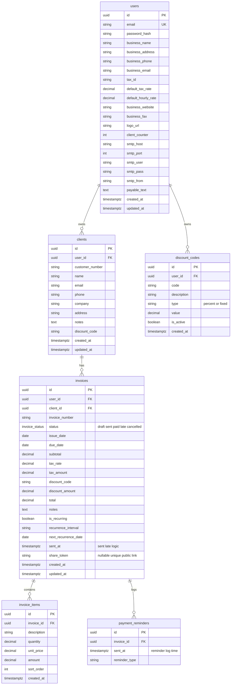

# Database diagram

Mermaid `erDiagram` is supported on GitHub and many Markdown viewers; for strict PostgreSQL types, column defaults, and indexes, see [schema.md](schema.md).

**Note:** `payment_reminders.sent_at` is the time a reminder was logged, not the same field as `invoices.sent_at` (when the invoice was marked sent).
