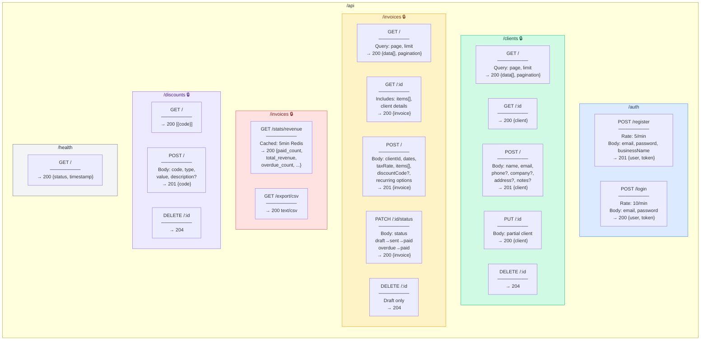
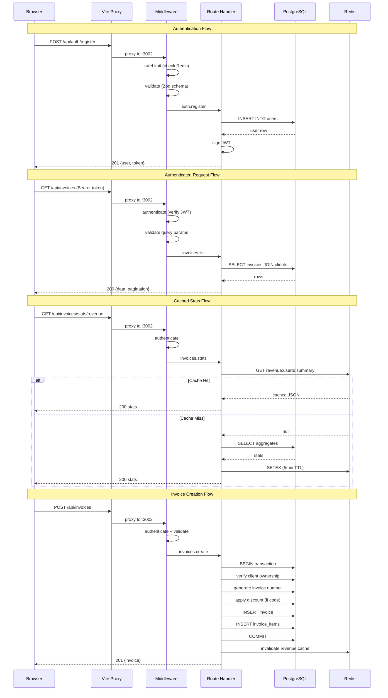
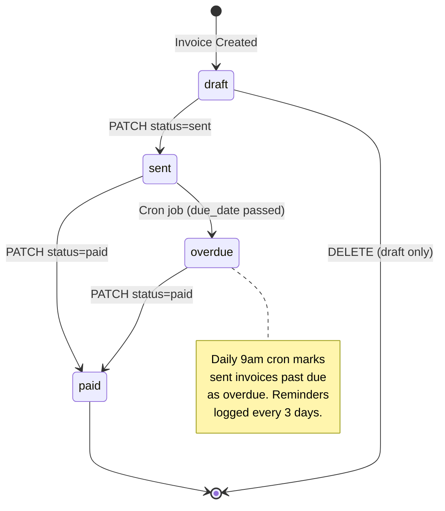
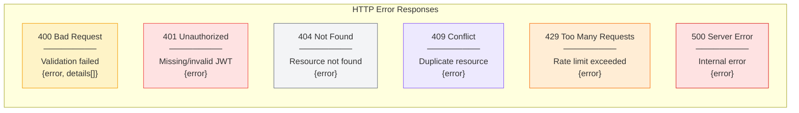

# API Reference Diagram

## Endpoint Map

```mermaid
graph LR
    subgraph API["/api"]
        direction TB

        subgraph Auth["/auth"]
            direction LR
            A1["POST /register<br/>─────────<br/>Rate: 5/min<br/>Body: email, password, businessName<br/>→ 201 {user, token}"]
            A2["POST /login<br/>─────────<br/>Rate: 10/min<br/>Body: email, password<br/>→ 200 {user, token}"]
        end

        subgraph Clients["/clients 🔒"]
            direction LR
            C1["GET /<br/>─────────<br/>Query: page, limit<br/>→ 200 {data[], pagination}"]
            C2["GET /:id<br/>─────────<br/>→ 200 {client}"]
            C3["POST /<br/>─────────<br/>Body: name, email,<br/>phone?, company?,<br/>address?, notes?<br/>→ 201 {client}"]
            C4["PUT /:id<br/>─────────<br/>Body: partial client<br/>→ 200 {client}"]
            C5["DELETE /:id<br/>─────────<br/>→ 204"]
        end

        subgraph Invoices["/invoices 🔒"]
            direction LR
            I1["GET /<br/>─────────<br/>Query: page, limit<br/>→ 200 {data[], pagination}"]
            I2["GET /:id<br/>─────────<br/>Includes: items[],<br/>client details<br/>→ 200 {invoice}"]
            I3["POST /<br/>─────────<br/>Body: clientId, dates,<br/>taxRate, items[],<br/>discountCode?,<br/>recurring options<br/>→ 201 {invoice}"]
            I4["PATCH /:id/status<br/>─────────<br/>Body: status<br/>draft→sent→paid<br/>overdue→paid<br/>→ 200 {invoice}"]
            I5["DELETE /:id<br/>─────────<br/>Draft only<br/>→ 204"]
        end

        subgraph Stats["/invoices 🔒"]
            direction LR
            S1["GET /stats/revenue<br/>─────────<br/>Cached: 5min Redis<br/>→ 200 {paid_count,<br/>total_revenue,<br/>overdue_count, ...}"]
            S2["GET /export/csv<br/>─────────<br/>→ 200 text/csv"]
        end

        subgraph Discounts["/discounts 🔒"]
            direction LR
            D1["GET /<br/>─────────<br/>→ 200 [{code}]"]
            D2["POST /<br/>─────────<br/>Body: code, type,<br/>value, description?<br/>→ 201 {code}"]
            D3["DELETE /:id<br/>─────────<br/>→ 204"]
        end

        subgraph Health["/health"]
            H1["GET /<br/>─────────<br/>→ 200 {status, timestamp}"]
        end
    end

    style Auth fill:#DBEAFE,stroke:#3B82F6,color:#1E3A5F
    style Clients fill:#D1FAE5,stroke:#10B981,color:#064E3B
    style Invoices fill:#FEF3C7,stroke:#F59E0B,color:#78350F
    style Stats fill:#FEE2E2,stroke:#EF4444,color:#7F1D1D
    style Discounts fill:#EDE9FE,stroke:#8B5CF6,color:#4C1D95
    style Health fill:#F3F4F6,stroke:#6B7280,color:#1F2937
```

## Request Flow

```mermaid
sequenceDiagram
    participant B as Browser
    participant V as Vite Proxy
    participant MW as Middleware
    participant R as Route Handler
    participant PG as PostgreSQL
    participant RD as Redis

    Note over B,RD: Authentication Flow
    B->>V: POST /api/auth/register
    V->>MW: proxy to :3002
    MW->>MW: rateLimit (check Redis)
    MW->>MW: validate (Zod schema)
    MW->>R: auth.register
    R->>PG: INSERT INTO users
    PG-->>R: user row
    R->>R: sign JWT
    R-->>B: 201 {user, token}

    Note over B,RD: Authenticated Request Flow
    B->>V: GET /api/invoices (Bearer token)
    V->>MW: proxy to :3002
    MW->>MW: authenticate (verify JWT)
    MW->>MW: validate query params
    MW->>R: invoices.list
    R->>PG: SELECT invoices JOIN clients
    PG-->>R: rows
    R-->>B: 200 {data, pagination}

    Note over B,RD: Cached Stats Flow
    B->>V: GET /api/invoices/stats/revenue
    V->>MW: proxy to :3002
    MW->>MW: authenticate
    MW->>R: invoices.stats
    R->>RD: GET revenue:userId:summary
    alt Cache Hit
        RD-->>R: cached JSON
        R-->>B: 200 stats
    else Cache Miss
        RD-->>R: null
        R->>PG: SELECT aggregates
        PG-->>R: stats
        R->>RD: SETEX (5min TTL)
        R-->>B: 200 stats
    end

    Note over B,RD: Invoice Creation Flow
    B->>V: POST /api/invoices
    V->>MW: proxy to :3002
    MW->>MW: authenticate + validate
    MW->>R: invoices.create
    R->>PG: BEGIN transaction
    R->>PG: verify client ownership
    R->>PG: generate invoice number
    R->>PG: apply discount (if code)
    R->>PG: INSERT invoice
    R->>PG: INSERT invoice_items
    R->>PG: COMMIT
    R->>RD: invalidate revenue cache
    R-->>B: 201 {invoice}
```

## Invoice Status Transitions

```mermaid
stateDiagram-v2
    [*] --> draft: Invoice Created
    draft --> sent: PATCH status=sent
    sent --> paid: PATCH status=paid
    sent --> overdue: Cron job (due_date passed)
    overdue --> paid: PATCH status=paid
    paid --> [*]

    draft --> [*]: DELETE (draft only)

    note right of overdue
        Daily 9am cron marks
        sent invoices past due
        as overdue. Reminders
        logged every 3 days.
    end note
```

## Error Codes

```mermaid
graph LR
    subgraph Errors["HTTP Error Responses"]
        E400["400 Bad Request<br/>─────────<br/>Validation failed<br/>{error, details[]}"]
        E401["401 Unauthorized<br/>─────────<br/>Missing/invalid JWT<br/>{error}"]
        E404["404 Not Found<br/>─────────<br/>Resource not found<br/>{error}"]
        E409["409 Conflict<br/>─────────<br/>Duplicate resource<br/>{error}"]
        E429["429 Too Many Requests<br/>─────────<br/>Rate limit exceeded<br/>{error}"]
        E500["500 Server Error<br/>─────────<br/>Internal error<br/>{error}"]
    end

    style E400 fill:#FEF3C7,stroke:#F59E0B
    style E401 fill:#FEE2E2,stroke:#EF4444
    style E404 fill:#F3F4F6,stroke:#6B7280
    style E409 fill:#EDE9FE,stroke:#8B5CF6
    style E429 fill:#FFEDD5,stroke:#F97316
    style E500 fill:#FEE2E2,stroke:#DC2626
```
