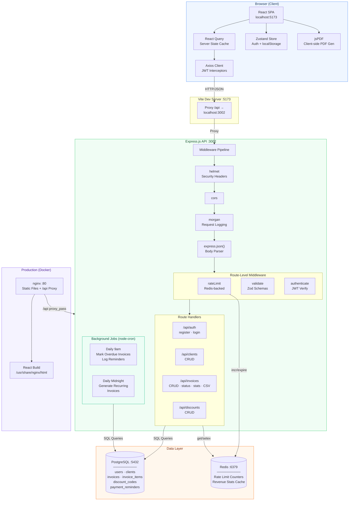

# Architecture Diagram

```mermaid
graph TB
    subgraph Browser["Browser (Client)"]
        SPA["React SPA<br/>localhost:5173"]
        RQ["React Query<br/>Server State Cache"]
        ZS["Zustand Store<br/>Auth + localStorage"]
        AX["Axios Client<br/>JWT Interceptors"]
        PDF["jsPDF<br/>Client-side PDF Gen"]
        SPA --> RQ
        SPA --> ZS
        SPA --> PDF
        RQ --> AX
    end

    subgraph Vite["Vite Dev Server :5173"]
        PROXY["Proxy /api →<br/>localhost:3002"]
    end

    subgraph API["Express.js API :3002"]
        direction TB
        MW["Middleware Pipeline"]
        HELMET["helmet<br/>Security Headers"]
        CORS["cors"]
        MORGAN["morgan<br/>Request Logging"]
        JSON["express.json()<br/>Body Parser"]

        MW --> HELMET --> CORS --> MORGAN --> JSON

        subgraph Routes["Route Handlers"]
            AUTH_R["/api/auth<br/>register · login"]
            CLIENT_R["/api/clients<br/>CRUD"]
            INV_R["/api/invoices<br/>CRUD · status · stats · CSV"]
            DISC_R["/api/discounts<br/>CRUD"]
        end

        subgraph RouteMiddleware["Route-Level Middleware"]
            RL["rateLimit<br/>Redis-backed"]
            VAL["validate<br/>Zod Schemas"]
            AUTHMW["authenticate<br/>JWT Verify"]
        end

        subgraph Jobs["Background Jobs (node-cron)"]
            OVERDUE["Daily 9am<br/>Mark Overdue Invoices<br/>Log Reminders"]
            RECUR["Daily Midnight<br/>Generate Recurring<br/>Invoices"]
        end

        JSON --> RouteMiddleware
        RouteMiddleware --> Routes
    end

    subgraph Data["Data Layer"]
        PG[("PostgreSQL :5432<br/>──────────<br/>users · clients<br/>invoices · invoice_items<br/>discount_codes<br/>payment_reminders")]
        RD[("Redis :6379<br/>──────────<br/>Rate Limit Counters<br/>Revenue Stats Cache")]
    end

    subgraph Prod["Production (Docker)"]
        NGINX["nginx :80<br/>Static Files + /api Proxy"]
        BUILT["React Build<br/>/usr/share/nginx/html"]
        NGINX --> BUILT
    end

    AX -->|"HTTP/JSON"| PROXY
    PROXY -->|"Proxy"| MW
    RL -->|"incr/expire"| RD
    Routes -->|"SQL Queries"| PG
    Routes -->|"get/setex"| RD
    Jobs -->|"SQL Queries"| PG
    NGINX -->|"/api proxy_pass"| API

    style Browser fill:#EFF6FF,stroke:#3B82F6,color:#1E3A5F
    style API fill:#F0FDF4,stroke:#22C55E,color:#14532D
    style Data fill:#FFF7ED,stroke:#F97316,color:#7C2D12
    style Prod fill:#F5F3FF,stroke:#8B5CF6,color:#4C1D95
    style Jobs fill:#ECFDF5,stroke:#10B981,color:#064E3B
```
