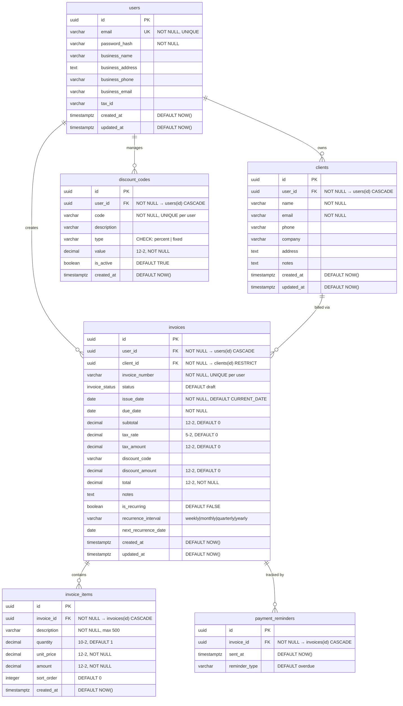

# Database Diagram

## Indexes

| Table | Index | Columns |
|-------|-------|---------|
| clients | idx_clients_user_id | user_id |
| invoices | idx_invoices_user_id | user_id |
| invoices | idx_invoices_client_id | client_id |
| invoices | idx_invoices_status | status |
| invoices | idx_invoices_due_date | due_date |
| invoice_items | idx_invoice_items_invoice_id | invoice_id |

## Cascade Rules

| Relationship | On Delete |
|-------------|-----------|
| users → clients | CASCADE (deleting a user deletes their clients) |
| users → invoices | CASCADE |
| users → discount_codes | CASCADE |
| clients → invoices | RESTRICT (cannot delete client with invoices) |
| invoices → invoice_items | CASCADE |
| invoices → payment_reminders | CASCADE |
