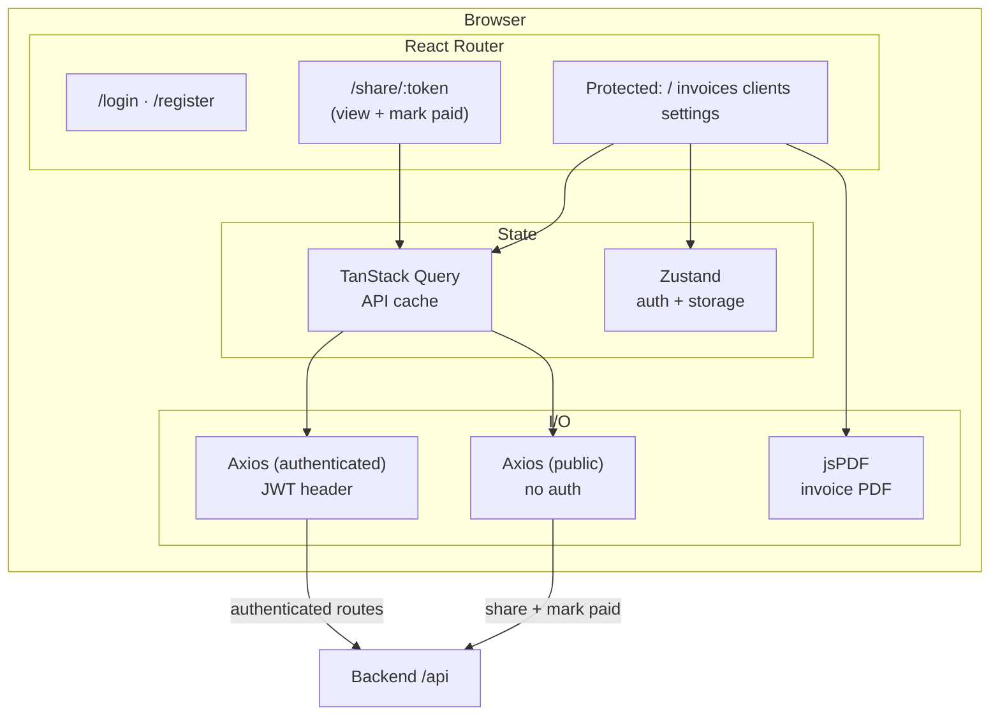

# Frontend overview

React 18 SPA built with Vite (`frontend/`). TypeScript throughout; Tailwind for styling.

## Structure

| Area | Role |
|------|------|
| `src/App.tsx` | `BrowserRouter`, route table, public vs protected layout |
| `src/layouts/AppLayout.tsx` | Sidebar + outlet for authenticated pages |
| `src/api/` | Axios instance (`client.ts`) + resource modules (`settings`, `data` backup helpers, …); base URL from `VITE_API_URL` |
| `src/store/` | Zustand auth store (persisted) |
| `src/pages/` | Page components (dashboard, invoices, clients, settings, …) |
| `src/utils/pdf.ts` | jsPDF invoice generation |

## Routing

Public: `/login`, `/register`, `/share/:token`. Authenticated routes are nested under `AppLayout`: `/`, `/invoices`, `/invoices/new`, `/invoices/:id`, `/invoices/:id/edit`, `/clients`, **`/clients/:clientId`** (client profile: details, invoice status, invoice links), `/clients/:clientId/stats` (redirects to profile `#invoice-status`), `/discounts`, `/settings` (tabbed: General, Discounts, Email, Backup). Unknown paths redirect to `/`.

See **[routes.md](routes.md)** for the full table, hashes (`#details`, `#invoice-status`, `#invoices`), and deep links.

## Frontend diagram

**Dev server:** Vite serves on port **5173** and can proxy `/api` to the backend (see `vite.config.ts`).

## Related docs

- [App routes and client profile](routes.md)
- [Tech stack](../tech-stack.md)
- [API reference](../api/reference.md)
