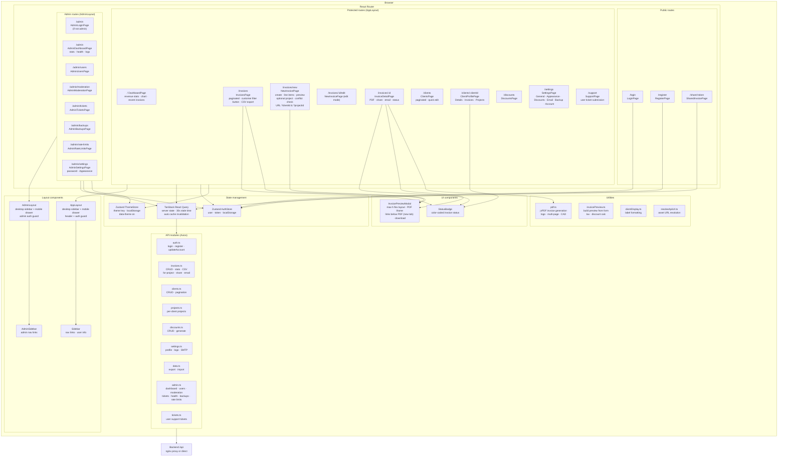
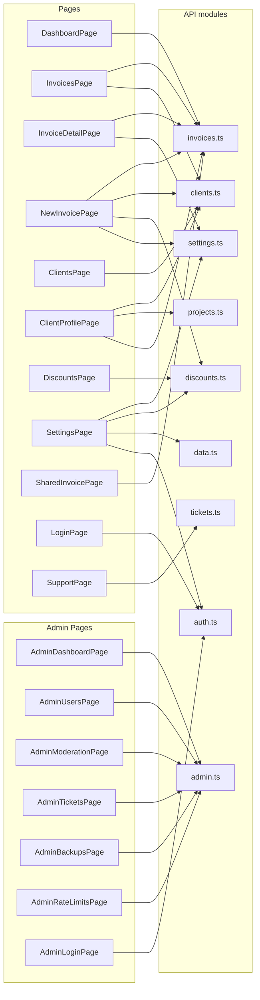
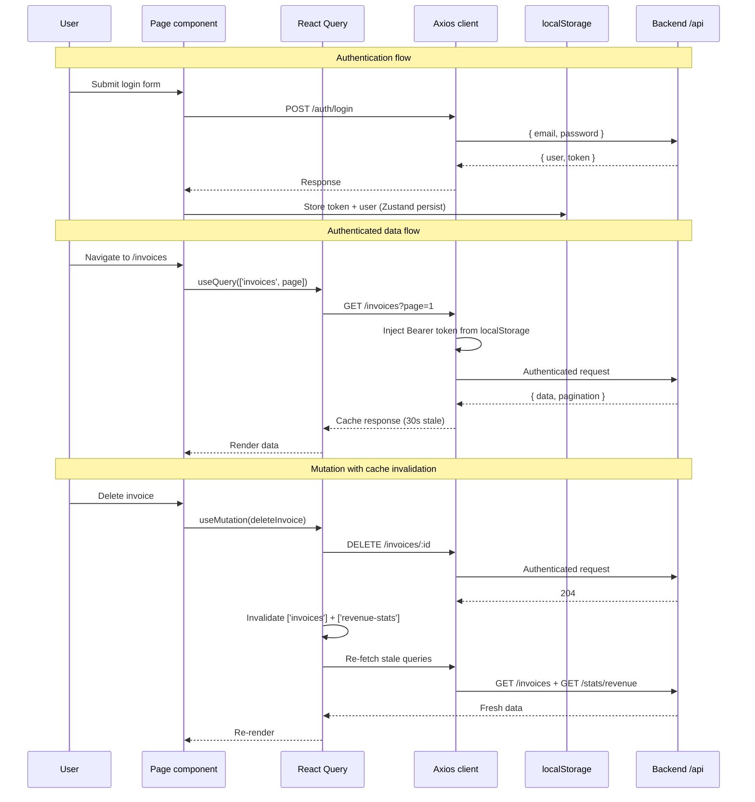
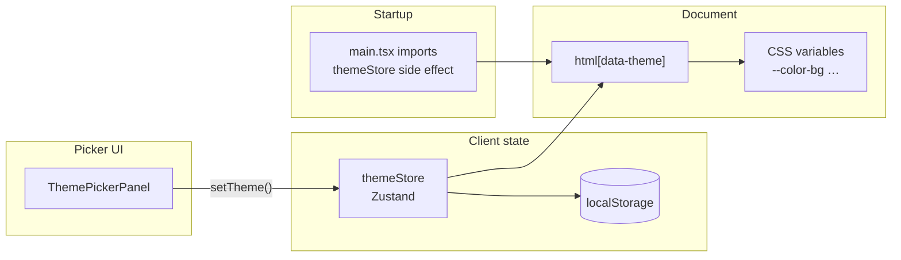

# Frontend overview

React 18 SPA built with Vite (`frontend/`). TypeScript throughout; Tailwind for styling.

## Structure

| Area | Role |
|------|------|
| `src/App.tsx` | `BrowserRouter`, route table, public vs protected vs admin layout |
| `src/components/layout/AppLayout.tsx` | Responsive vendor layout: desktop sidebar + mobile drawer, header, outlet; includes quick links to admin and client portals |
| `src/components/layout/AdminLayout.tsx` | Responsive admin layout: desktop sidebar + mobile drawer; shows admin login if not authenticated as admin |
| `src/components/layout/AdminSidebar.tsx` | Admin navigation links (desktop and mobile drawer) |
| `src/api/` | Axios instance (`client.ts`) + resource modules (`clients`, `projects`, `settings`, `data`, `admin`, `tickets`, …); base URL from `VITE_API_URL` |
| `src/stores/` | Zustand **auth** store (persisted); `isAdmin()` helper for role check; **`themeStore.ts`** — selected palette + `localStorage` + `document.documentElement.dataset.theme` |
| `src/components/ThemePickerPanel.tsx` | Shared **Appearance** UI (four themes); used by Settings, portal Account, admin Settings |
| `src/index.css` | Theme tokens: `--color-bg`, `--color-surface`, `--color-primary`, `--color-sidebar-*`, etc., per `[data-theme="…"]`; `html` / `body` / `#root` use `--color-bg` for full-viewport canvas |
| `tailwind.config.js` | Maps semantic colors to CSS variables (`bg-bg`, `text-text`, `border-border`, `bg-sidebar-bg`, …) |
| `src/pages/` | Page components (dashboard, invoices, clients, settings, …) |
| `src/pages/portal/` | **Client portal** pages (login, dashboard, invoices, projects, project detail, account, security); `PortalLayout` (no main sidebar) |
| `src/components/portal/` | `PortalLayout.tsx` and shared portal chrome |
| `src/components/client/` | Client profile subviews (e.g. `ClientProjectsTab.tsx`) |
| `src/pages/admin/` | Admin panel pages (dashboard, users, moderation, tickets, backups, rate limits, login) |
| `src/utils/pdf.ts` | jsPDF invoice generation |

## Routing

Public: `/login`, `/register`, `/share/:token`, **`/portal/login`** (client portal). Authenticated routes are nested under `AppLayout`: `/`, `/invoices`, `/invoices/new`, `/invoices/:id`, `/invoices/:id/edit`, `/clients`, **`/clients/:clientId`** (client profile: **Details**, **Invoices**, **Projects**, **Portal** tabs), `/clients/:clientId/stats` (redirects to profile `#invoice-status`), `/discounts`, `/settings` (tabbed: General, Discounts, Email, Backup, Account), `/support`. **`/portal/*`** (after client login) uses **`PortalLayout`** instead of `AppLayout`. Admin routes are nested under `AdminLayout` with a separate login: `/admin` (dashboard + health), `/admin/users`, `/admin/moderation`, `/admin/tickets`, `/admin/backups`, `/admin/rate-limits`. Unknown paths redirect to `/`.

Vendor and admin shells are mobile-friendly: below desktop breakpoints, sidebars collapse into a slide-in drawer, and page padding/header controls scale down for smaller screens.

See **[routes.md](routes.md)** for the full table, hashes (`#details`, `#invoice-status`, `#invoices`, `#projects`, `#portal`), client portal paths, and deep links. **[Client portal docs](../client-portal/overview.md)** cover login, 2FA, and API usage.

## Frontend diagrams

### Component architecture

### Page → API module mapping

### Data flow

**Dev server:** Vite serves on port **5173** and can proxy `/api` to the backend (see `vite.config.ts`).

## UI themes

Four palettes — **Starter** (blue-violet), **Forest** (green), **Twilight** (grey/black), **Ember** (warm coral) — are defined as CSS custom properties in `src/index.css` under `:root` / `[data-theme="…"]`. Tailwind’s `extend.colors` maps utility classes such as `bg-bg` (page canvas), `bg-surface` (cards), `text-text`, `border-border`, and `bg-sidebar-bg` to those variables so vendor app, admin, and portal screens stay consistent when the user switches themes.

Persistence: `src/stores/themeStore.ts` (Zustand) writes the selected key to `localStorage`, sets `document.documentElement.dataset.theme`, and is loaded from `main.tsx` on startup. Users can change the theme from **Settings → General → Appearance**, **Client portal → Account**, or **Admin → Settings** (shared `ThemePickerPanel` component).

### Theming data flow

## New invoice and projects

`NewInvoicePage` loads client projects when a client is selected and offers an optional **Related project**. Choosing a project (or opening `/invoices/new` with `clientId` and `projectId` query params) can prefill the **first line** description from the project’s description and the **first line** hours from the project’s hours when those values are set; if the project marks hours as a maximum, line hours are capped accordingly. When a project is selected, the page loads the client’s invoices to detect **one-invoice-per-project** conflicts: a bordered amber alert with links if matches exist, or—if that fetch fails—a plain amber line (*Selected project already has an invoice, delete existing invoice before creating a new one.*). The **Projects** tab on the client profile (`ClientProjectsTab.tsx`) includes a per-project **Create** link next to **View** and **Download** that deep-links to the new-invoice page with both IDs.

See **[routes.md — New invoice and related projects](routes.md#new-invoice-and-related-projects)** for full behavior and deep links.

## Related docs

- [App routes and client profile](routes.md)
- [Tech stack](../tech-stack.md)
- [API reference](../api/reference.md)
